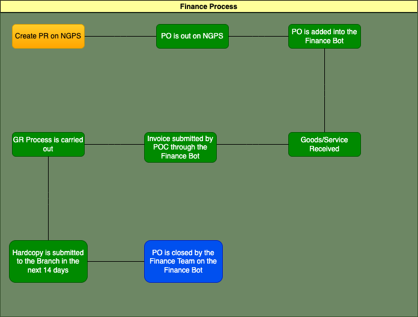

# Finance Bot
## Overview
Finance Bot is a Telegram Bot that is using the [Aiogram 2.21 library](https://docs.aiogram.dev/en/latest/). The bot helps the Finance Team to remind units on their outstanding Purchase Orders (PO) and to prevent late Good Receive (GR) on these PO. Only the POCs of the units would be allowed to use the bot allowing a single point of contact (POC) for the unit and taking the responsibility of tracking the PO on their side. The Finance team can control who gets the access to the bot, when the users get the reminder and which PO are added to the bot. These are some of the features of the Finance Bot:
1. Reminder Text - the bot sends out a list of PO and their deadlines to the various POCs when the Finance Team clicks on the "/reminder" button on the bot.
2. Receiving Invoice - the bot receives invoices in PDF format and record it down on Baserow. Simultaneously, the bot sends out the invoices to the Finance Team as a reminder to them to start the GR process
3. PO Management - (*critical aspect of the bot*) the Finance Team adds PO to the bot which would be recorded on Baserow and would be used for reminding the users. PO can be closed as well once they are deemed to be completed
4. Team Management - the Finance team can decide on granting access to the bot to users depending on their role in the Finance process
5. PO Database - the bot is able to extract information of various units and their outstanding PO to track them

This program runs on Python 3.10.5 and uses API from [Baserow](https://baserow.io/api-docs/database/27947) ⬅️  would need Baserow Login Credentials. Baserow acts as an online table that enables the bot to store and extract real-time.

**Image 1**: PO Table on Baserow that the bot uses to store and extract data

 
## Finance Process
Image 2: The Diagram below shows the Finance Process and how the Finance Bot fits into the process





Abbreviations:
- PR: Purchase Requisition
- PO: Purchase Order
- GR: Goods Receipt

The PO is added into the Finance bot when the PO is out on NGPS and the status on Baserow would be Open as seen in Image 1. Only when the Finance Team confirms that the invoice received is acceptable, the PO would be closed.

**Take Note**: For PO with V2 and etc, please know to close the previous version before adding the new version to Finance Bot. Add V2 at the end of the title to differentiate [(the bot will not accept PO with more than 10 characters)](https://github.com/Finance-1TPT/finance_bot/blob/main/po_management.py) as shown below. This measure is in place to ensure that the right PO is added to the table and to reduce the human error from the Finance Team when inputting the PO.

```python
if len(m.text) != 10:
        await types.ChatActions.typing()
        await m.answer(f'❌PO must be 10 characters❌ please try again\n\n/cancel to stop the submission')
        await Close_PO.PO.set()
```


## start.py
All users would start from this when using the bot for the first time. Depending on who the user is (using the user_identification function), the bot categorises users and displays different buttons available to the users. 
1. POC get the following buttons:
    - "/start": allows users to restart the bot and see the outstanding PO which can be found in the 'Menu' (applicable to all users)
    - "/send_invoice": allows users to send invoice to the bot
```python
markup = types.ReplyKeyboardMarkup(resize_keyboard=True, one_time_keyboard=True, selective=True)
markup.add("/send_invoice")
```

2. Finance Team get the following buttons: 
    - "/po_database": displays the number of outstanding PO in the battalion and can be drilled down to display each unit and their respective PO
    - "/po_management": adds new PO to the bot (Open Status) and remove PO (Close Status)
    - "/team_management": grants and removes access users to the bot
    - "/reminder": bot sends out the list of outstanding PO to users
    - "/baserow_cred": contains the login credentials for Baserow to see the backend
    - "/send_invoice": allows users to send invoice to the bot
```python
def finance_keyboard():
    markup = ReplyKeyboardMarkup(resize_keyboard=True, one_time_keyboard=True)
    markup.add("/po_database")
    markup.add("/po_management")
    markup.add("/team_management")
    markup.add("/reminder")
    markup.add("/baserow_cred")
    markup.add("/send_invoice")
    return markup
```

start.py uses the [filter_camp function](https://github.com/Finance-1TPT/finance_bot/blob/317604feebda6fb4343f461cb06892edbfb78211/functions.py) which is a critical part of the Finance Bot as it retrieves all the PO from Baserow and filters the unit that is needed. This function is applied to the remind_text functions and any parts of the bot that shows PO to the user. The function converts from json to the pandas (pd) dataframe.

```python
def filter_camps(camp):
    results = requests.get(f'{api_url}{PO_TABLE}/?user_field_names=true', headers=HEADERS).json()
    status = []
    coy = []
    for i in results['results']:
        status.append(i[PO_details.STATUS.value]['value'])
        coy.append(i[PO_details.COY.value]['value'])
    df = pd.DataFrame(results['results'])
    df1=df.drop(columns=['Status', 'id','order', 'Coy'])
    df1['Status'] = status
    df1['Coy'] = coy
    filtered = df1.loc[(df1["Coy"] == camp) & (df1["Status"] == "Open")]
    return filtered
```

[remind_text function](https://github.com/Finance-1TPT/finance_bot/blob/317604feebda6fb4343f461cb06892edbfb78211/async_functions.py) sends out messages to the users on their outstanding PO on Baserow. Based on how close the PO gets to the deadline, more emojis would be added to the text and counts the number of urgent PO which shows on the bot (this method is used in multiple areas of the script).
```python
if days_to_deadline >10:
    alert = ""
elif days_to_deadline >= 7:
    alert = "🚨"
elif days_to_deadline >= 1:
    alert = "⚠️"
elif days_to_deadline <= 0:
    alert = "💀"
```

## po_database.py
PO Database retrieves all the PO from Baserow Table that are still Open and counts them by their respective units. To identify the outstanding PO, it can be further drilled down to view them using /"unit" (for eg: /hq, /kranji) or alternatively there would be buttons presented without the need to type.

The bot uses the filter_camps functions to get the PO for each camp and then counts. It drills down to the urgency of the PO as well. Below is how the bot compiles message:
```python
today = datetime.today()
        today1 = str(datetime.strftime(today, "%d-%m-%Y"))
        camps=['HQ', 'HMCT', 'KRANJI', 'KHATIB', 'MANDAI','ALPHA', 'CHARLIE', 'LTC']
        string = f'----caa {today1}----\n\n'
        for i in camps:
            data = filter_camps(i)
            alert_counter = 0
            hazard_counter = 0
            skull_counter = 0
            #counts the number of alerts
            for x in range(data.shape[0]):
                await types.ChatActions.typing()
                date = datetime.strptime(str(data.iloc[x,4]),"%Y-%m-%d")
                days_to_deadline = int(days_between(date, today))
                if days_to_deadline >10:
                    pass
                elif days_to_deadline >= 7:
                    alert_counter += 1
                elif days_to_deadline >= 3:
                    hazard_counter += 1
                elif days_to_deadline <= 0:
                    skull_counter += 1
            text = f'{i}: {data.shape[0]}\n🚨: {alert_counter}\n⚠️: {hazard_counter}\n💀: {skull_counter}\n\n'
            string += text
        await m.answer(f'These are the number of current POs opened at the moment in the Battalion 🫡')
        await bot.send_message(m.chat.id, md.text(string), parse_mode=ParseMode.MARKDOWN)
```

To drill down the users can use the keyboard buttons or use the '/' commands. To do a custom command such as /hq, the following needs to be declared (can be applied elsewhere):
```python
dp.register_message_handler(camp_database, commands = ['hq', 'hmct', 'kranji', 'khatib', 'mandai','alpha', 'charlie', 'ltc'])
```

## po_management.py
PO Management is the critical part of the bot without it, the bot would not be performing as intended. PO can either be Open or Close in status on Baserow:
1. Open: Outstanding, PO is yet to be completed
2. Close: Finance Process is finished

Finance Team would add the PO into Baserow through the bot using the '/add_po' button or typing it. The bot asks the following questions to add the PO:
1. PO number, ensure that it is 10 characters
2. Title of the PO on NGPS
3. COY/Node the PO was raised for
4. Confirmation to add on Baserow

Finance Team can close the PO here once the PO has completed the finance process using '/close_po'. The bot asks the following questions to close the PO:
1. PO number, ensure that it is 10 characters
2. Confirmation to close

Sequences of conversations can be done by using [StatesGroup and State function](https://github.com/Finance-1TPT/finance_bot/blob/main/classes.py) from Aiogram library. In this example, this is the flow of adding PO (Open_PO) and closing PO in the bot.
```python
from aiogram.dispatcher.filters.state import State, StatesGroup
class Open_PO(StatesGroup):
    PO = State()
    Title_name = State()
    Coy = State()
    response = State()

class Close_PO(StatesGroup):
    PO = State()
    response = State()
```

[FSMContext (Finite State Machine)](https://docs.aiogram.dev/en/latest/examples/finite_state_machine_example.html   ) is used to store the data that is sent by the user on the frontend of the bot. Below, it shows how the bot asks from one question to another and stores the information as shown in the comments
```python
def setup(dp:Dispatcher)
    dp.register_message_handler(close_po, commands= 'close_po')
    dp.register_message_handler(closing_confirmation, state=Close_PO.PO)
async def close_po(m: types.Message):
    await Close_PO.PO.set()
    await m.answer(f'What is the PO number to be closed? Must be 10 characters (Eg: OA300052312)')

async def closing_confirmation(m:types.Message, state:FSMContext):
    try:
        if len(m.text) != 10:
            raise ValueError
    except ValueError:
        await m.answer(f'❌PO must be 10 characters❌ please try again')
    else:
        async with state.proxy() as data: 
            data['PO'] = m.text #data from user is stored here, where m.text is the text from the user
        await Close_PO.response.set()
        await m.reply(f'Are you sure you want to close this PO?👀\n\n', reply_markup=confirmation_keyboard())
```

## team_management.py
Team Management allows the Finance Team to add, assign roles and remove users from the bot. Roles are assigned simply based on which unit the POC is from except for HQ where it would be referred to as Finance Team since Finance Team handles the PO for HQ.

When adding a user to the bot, the bot will ask the following questions:
1. Telegram ID
2. COY (which is the role of the member)
3. Confirmation

Image 3: Shows how the bot saves the member's information on Baserow along with the options of COY


When removing a user from the bot, the bot will ask the following question:
1. Telegram ID 


## reminder.py
Reminder is a button on the Finance Bot that would send out outstanding to the various POC to garner their attention to the PO raised by them. Reminder is not automatically scheduled as it is used to get the Finance Team to use the bot every now and secondly, it is to prevent spam on POCs' chats thus losing their interest in the Finance Bot. Hence, the reminder is decided by the Finance Team on when they would like to do it in the working week.

The following codes extract the user ids from the table (shown in Image 3) and uses the same remind_text function that is used on start.py:
```python
#extracting the user info from the table 62322
        user_list = userinfo()
        try:
            #first loop for the number of users
            for user_id in user_list:
                #just use the reminder_text function for this use
                if await reminder_text(user_id=user_id):
                    count += 1
            #20 messages per second (Limit: 30 messages per second)
                await asyncio.sleep(.05)
        finally:
            log.info(f'{count} messages are successfully sent out')
            await m.reply(f'{count} messages are sent out', reply_markup=finance_keyboard())
```

## functions.py
Functions are created to make the front-end of the codes cleaner. General defined functions and classes are created here, not mixing the asychronous defined functions. 

An example of date function used in the functions.py that returns a working date:
```python
def date_calculate(date, num_of_days):
    #convert the date into a usable format to calculate
    #d1 = datetime.strptime(date, "%Y-%m-%d")
    #add the number of days we want
    d2 = date + timedelta(days=num_of_days)
    #creating a list of holiday dates for the whole year using the HolidaysSG class
    hol = []
    for holiday in HolidaysSG:
        hol.append(holiday.value)
    #while loop to iterate through the list to make sure all of the dates are covered
    i = 0
    while i < 12:
        if hol[i] == d2:
            d2 = d2 - timedelta(days=1)
            i = 0
            #weekend checker
            if d2.strftime('%A') == "Saturday":
                d2 = d2 - timedelta(days=1)
            elif d2.strftime('%A') == "Sunday":
                d2 = d2 - timedelta(days=2)
            else:
                pass
        else:
            i+=1
            pass
    return d2
```


***Take note*** that the holidays are hardcoded into the program, so this is the area that needs to maintained until a better solution comes through.
```python
@unique
class HolidaysSG(Enum):
    New_year = datetime.strptime("01/01/2022", "%d/%m/%Y")
    CNY = datetime.strptime("01/02/2022", "%d/%m/%Y")
    CNY_2 = datetime.strptime("02/02/2022", "%d/%m/%Y")
    Good_Friday = datetime.strptime("15/04/2022", "%d/%m/%Y")
    Labour_day = datetime.strptime("02/05/2022", "%d/%m/%Y")
    Eid = datetime.strptime("03/05/2022", "%d/%m/%Y")
    Vesak = datetime.strptime("16/05/2022", "%d/%m/%Y")
    Eid_al_adha = datetime.strptime("10/07/2022", "%d/%m/%Y")
    Eid_al_adha_2 = datetime.strptime("11/07/2022", "%d/%m/%Y")
    NDP = datetime.strptime("09/07/2022", "%d/%m/%Y")
    Diwali = datetime.strptime("24/10/2022", "%d/%m/%Y")
    Christmas_day = datetime.strptime("26/12/2022", "%d/%m/%Y")
```

## invoice.py
POC are required to scan the invoice received from the company and sent to the Finance Bot. 

The invoice needs to be named specifically in this convention:
1. PO number_Date invoice was received in DDMMYY (for eg: OA30044718_080922) 
2. has to be in .pdf format

Not fulfilling either one of these conditions, the Finance Bot would reject the submission.

To upload any file to Baserow from Telegram, begin by declaring the content type.
```python
dp.register_message_handler(transmit_invoice, state=Invoice.Invoice, content_types=ContentTypes.DOCUMENT) 
```
Check the document that is submitted by the user whether it fulfils the conditions.
```python
# extract the database and compare the PO
        po_data = filter_camps("HQ")
        for i in po_data["PO"]:
            await types.ChatActions.typing()
            if m.document.file_name.startswith(i,0,10):
                name_check = True
                if m.document.file_name.endswith(".pdf", 17, 21):
                    format_check = True
                    break
                else:
                    format_check = False
            else:
                name_check = False
```

Once all the conditions are met, download the document into program temporarily using BytesIO since images and other media types are in bytes. Follow the exact steps to upload the file. Some important functions to know here are [baserow.py's upload_file and update_row](https://github.com/Finance-1TPT/finance_bot/blob/main/baserow.py). Just by doing this step, the upload to Baserow from Telegram is done.

```python
# declaring doc here to set aside for document
            doc = BytesIO()
            # downloading the document into the doc
            await m.document.download(destination_file=doc)
            filename = await baserow.upload_file(doc, m.document.file_name)
            try:
                if filename:
                    payload = {
                        "Invoices" : [{"name":filename}]
                        }
                po = m.document.file_name[0:10]
                row_id = find_row(po)
                success = await baserow.update_row(
                    63578, row_id, payload
                )
```

This [function](https://github.com/Finance-1TPT/finance_bot/blob/main/async_functions.py) also sends the invoice to Finance Team after uploading which serves as a notification to proceed on the GR for that PO which the following codes do this:
```python
async def sendfile(user_id: int, file_id:str, disable_notification:bool = False) ->bool:
    try:
        await bot.send_document(user_id, document=file_id, disable_notification=disable_notification,)
    #to make sure we handle all kinds of errors when sending out the messages
    except exceptions.BotBlocked:
        log.error(f'Target [ID:{user_id}]: blocked by user')
    except exceptions.ChatNotFound:
        log.error(f'Target [ID:{user_id}]: invalid user ID')
    except exceptions.RetryAfter as e:
        log.error(f'Target [ID{user_id}]: Flood limit is exceeded. Sleep {e.timeout} seconds')
        await asyncio.sleep(e.timeout)
        #recursive
        await bot.send_document(user_id, document=file_id, disable_notification=disable_notification,)
    except exceptions.UserDeactivated:
        log.error(f'Target [ID{user_id}]: user is deactivated')
    except exceptions.TelegramAPIError:
        log.exception(f'Target [ID:{user_id}]: failed')
    else:
        log.info(f'Target [ID"{user_id}]: success')
        return True
    return False
```

## Deploying process
main.py should contain these lines of codes at the end of script. This leads you to the webhooking which leads the bot to listen out for any kind of requests or activity

```python
if __name__ == '__main__':
    start.setup(dp)
    po_database.setup(dp)
    po_management.setup(dp)
    team_management.setup(dp)
    reminder.setup(dp)
    invoice.setup(dp)
    scheduler.setup(runner)
    baserow.setup(runner)
    if WEBHOOK:
        logger.info("Running in Webhook Mode")
        app = web.Application()
        runner.on_startup(on_startup_webhook, webhook=True, polling=False)
        runner.set_webhook(
            webhook_path=f"/{WEBHOOK_PATH}",
            web_app=app
        )

        healthcheck.setup(runner)

        runner.run_app(
            host="0.0.0.0", 
            port=10000
        )
    else:
        logger.info("Running in Polling Mode")
        runner.start_polling()
```

To deploy the bot a few things need to be done:
1. create environment variables in .env files which allows you to import the file onto [render.com](https://render.com/), where we would be deploying the Finance Bot
2. create config.py and extract the environment variables to the python script
3. create and copy the scheduler.py and healthcheck.py, which is necessary for auto running the script in render.com and ensuring that it is active
4. create requirements.txt using pipreq library and executing it in the terminals

### Environment Variables
Setting up the environment variables .env by doing this. Read about the environment variables to help you to understand how to efficiently utitlise them.

```python
#fake code
BASEROW_TOKEN = fsdkfjwkeuieoqoi21321903:12023491223

```

Below are the codes for extracting values from config.py and setting up the webhooking URL which would be used in the main.py

```python
from envparse import env
env.read_envfile()

BASEROW_TOKEN = env.str("BASEROW_TOKEN")
BASEROW_USERNAME = env.str("BASEROW_USERNAME")
BASEROW_PASSWORD = env.str("BASEROW_PASSWORD")
BOT_TOKEN = env.str("BOT_TOKEN")
PO_TABLE = env.int("PO_TABLE")
BOT_ACCESS_TABLE = env.int("BOT_ACCESS_TABLE")
WEBHOOK = env.bool("WEBHOOK")
WEBHOOK_PATH = env.str("WEBHOOK_PATH", default = "webhook")
WEBHOOK_URL = f'https://finance-1tpt-bot.onrender.com/{WEBHOOK_PATH}'
```

### scheduler.py and healthcheck.py
Scheduler is used to auto run a block of codes, for example, in the baserow.py the scheduler runs reruns the script to get the JWT token every other hour. Both of these files can be just copied and pasted for any kind of usecase.

### requirements.txt
This file is needed for deployment in order to use the right version of the libraries. Use only the libraries that are used to create the bot and remove the additional libraries that are unnecessary to speed up deployment builds. Install the [pipreqs](https://pypi.org/project/pipreqs/) library to create the requirements.txt. **DO not use the pip3 freeze or pip freeze** command as it simply declares all the libraries that are on your local machine.


## Github
A github account is created for the branch, so all you need to do is to get the credentials for it.

1. Create a new repository to insert your new files inside (For fixing bugs, create a new [branch](https://www.atlassian.com/git/tutorials/using-branches#:~:text=The%20git%20branch%20command%20lets,checkout%20and%20git%20merge%20commands.))
2. Add in all your files into the new repository except for the .env file as it is confidential (the secret keys would all be added onto render.com instead)
3. Commit the changes to the main, and you are now able to move onto deploying on render.com
4. For fixing bugs, once you have created a branch and amended the things that needs to be amended. Merge the branch back to the main by clicking on "pull requests"

## Render.com
render.com is a deploying platform that launches any kind of apps. 

1. Click on the "Web Service"


2. Connect to your repository from Github
3. Enter a name for your deployment
4. Ensure that the region is Singapore

5. On the Start Command section, type "python main.py". This means command is basically executing the main.py script same as way as on Visual Studio Code
6. Under Advanced Section, insert your variables from the .env and add your .env file as a secret file

7. Under Advanced Section, type "/healthcheck" under the Health Check Path

After all these steps are done, deploy the app. It would take some time to build it, around 10-15mins. By the end of the build, you should see this


## StatusCake
Statuscake pings your bot server every other minute to ensure that it is active at any given moment. 

1. Go to 'New Uptime Test' and put any Test Name
2. Type the URL, copy the URL from render.com and add "/healthcheck" behind (for example: "https://finance-1tpt-bot.onrender.com/healthcheck"). You can find the URL here.

3. You can click the check rate to be around 15 mins and any other settings you can tweak based on your usecase in reference to their [documentation](https://www.statuscake.com/kb/)


## Conclusion
While these are the steps to a standard telegram bot, there are certainly different approach to building it especially with code. This documentation can be used as a reference to get you started and you can explore further on making it even better than the one built here. 